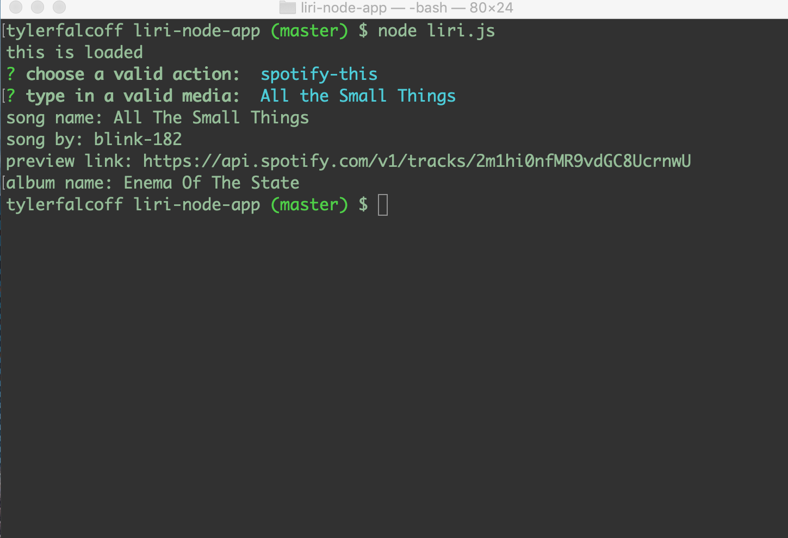

# Liri Node App

*  Problem: Having to search through multiple mediums to attain information about the bands/movies/artists you're most interested in. The app reaches out to different reference sites from a central hub.
* High-level org: The application is divided into several functional subsections:
    * Handler (logical flow)
    * Spotify
    * BandIsInTown
    * IMDB
* Instructions for running the app:
    * `node liri.js <desired-action> <media query>`
    * `node liri.js`
* Here's an example of the app in use:
    
* Deployed on [GitHub](https://github.com/tyfal/liri-node-app)
* Uses:
    * Moment
    * Spotify API
    * Axios
        * BandsInTown API
        * OMDB API
    * DotEnv
    * Inquirer
* Role in development - full functionality

